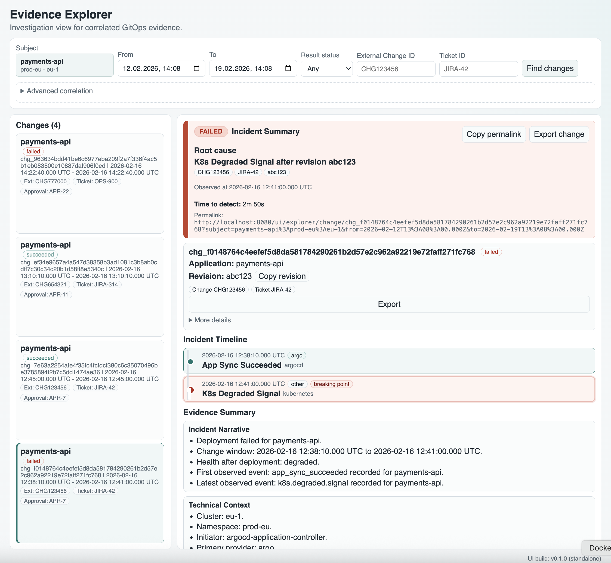

# Evidra-GitOps

[](https://github.com/vitas/evidra-gitops/actions/workflows/ci.yml)
[](https://github.com/vitas/evidra-gitops/actions/workflows/release.yml)
[](go.mod)
[](LICENSE)

Argo CD deployment-change investigation and evidence tooling for GitOps environments.

Evidra is an open-source tool developed and maintained by SameBits.

Evidra-GitOps explains **what happened during a deployment** and produces
**audit-ready evidence** from Argo CD history.

It does **not** deploy, monitor, or alert.  
It helps you **understand, trace, and export** production changes.

---

## Core concept: Change

**Change** is the primary investigation unit in Evidra-GitOps.

A Change represents a single Argo CD deployment operation with:

- revision and source reference
- target cluster and namespace
- initiator identity
- timestamps and result
- health transitions after deploy
- attached external change / ticket annotations
- supporting evidence timeline

All search, UI, and export revolve around **Change**, not raw events.

Change view includes investigation trust anchors:

- visible Change Summary (what/where/who/result)
- stable permalink for shared investigation context
- observational degradation-after-deploy indicator (non-causal wording)
- evidence freshness/completeness hint
- audit-grade export metadata

---

## UI preview



---

## Documentation

- Quickstart: [`docs/setup/quickstart.md`](docs/setup/quickstart.md)
- Deployment (Kustomize): [`docs/setup/deployment-kustomize.md`](docs/setup/deployment-kustomize.md)
- Adoption guide: [`docs/setup/adoption-guide.md`](docs/setup/adoption-guide.md)
- Configuration modes: [`docs/setup/config-modes.md`](docs/setup/config-modes.md)
- Architecture (v0.1): [`docs/architecture/architecture-v1.md`](docs/architecture/architecture-v1.md)
- Argo evidence model: [`docs/architecture/argo-evidence-model.md`](docs/architecture/argo-evidence-model.md)
- Argo ingest logic (v0.1): [`docs/architecture/argo-ingest-logic.md`](docs/architecture/argo-ingest-logic.md)
- OpenTelemetry integration: [`docs/architecture/otel-integration.md`](docs/architecture/otel-integration.md)
- ADR: Ingestion model: [`docs/adr/000X-ingestion-poll-and-watch.md`](docs/adr/000X-ingestion-poll-and-watch.md)
- Plan: Watch backend (v0.2): [`docs/architecture/ingestion-watch-plan-v0.2.md`](docs/architecture/ingestion-watch-plan-v0.2.md)
- API contracts: [`docs/api/contracts-v1.md`](docs/api/contracts-v1.md)
- Specs: [`docs/specs/`](docs/specs/)
- Argo annotations integration: [`docs/integration/argo-annotations.md`](docs/integration/argo-annotations.md)
- Incident walkthrough (v0.1): [`docs/stories/incident-walkthrough-v0.1.md`](docs/stories/incident-walkthrough-v0.1.md)
- UI Explorer (v1): [`docs/ui/explorer-v1.md`](docs/ui/explorer-v1.md)
- UI E2E testing: [`docs/testing/ui-e2e.md`](docs/testing/ui-e2e.md)
- UI use case mapping: [`docs/testing/ui-use-cases.md`](docs/testing/ui-use-cases.md)
- Release notes (v0.1.0): [`docs/release/v0.1.0.md`](docs/release/v0.1.0.md)
- Release criteria: [`docs/release/v0.1.0-criteria.md`](docs/release/v0.1.0-criteria.md)

---

## External change & ticket correlation

Evidra-GitOps can link deployments to enterprise change management using
Argo CD Application annotations:

```yaml
metadata:
  annotations:
    evidra.rest/change-id: CHG123456
    evidra.rest/ticket: JIRA-123
```

These references appear in:

- Change view
- search results
- exported evidence

No direct ITSM or Jira integration is required in v0.1.

---

## Architecture (v0.1)

Argo-first, read-only evidence model

Argo CD -> ingest -> normalize -> Change timeline -> API -> Explorer UI -> export

Key principles:

- Argo CD is the single upstream signal source
- Evidence is append-only and deterministic
- UI is investigation-first, not monitoring
- Installation is lightweight and self-contained

---

## Observability (OpenTelemetry)

Evidra-GitOps uses [OpenTelemetry](https://opentelemetry.io/) as its native observability stack for traces, metrics, and structured logging.

### Distributed tracing

Spans cover the full request lifecycle: HTTP handling (`otelhttp`), service orchestration, change projection, Argo collector polls, evidence pack generation, and database queries (`otelsql`). W3C Trace Context propagation is enabled by default.

Configure via environment variables:

```
EVIDRA_OTEL_TRACES_EXPORTER=otlp        # none | otlp | stdout
EVIDRA_OTEL_EXPORTER_ENDPOINT=localhost:4317
EVIDRA_OTEL_SAMPLER_TYPE=parentbased_traceidratio
EVIDRA_OTEL_SAMPLER_ARG=1.0
```

### Metrics

Custom application metrics are exposed at `GET /metrics` via the OTel Prometheus exporter. All metric names use the `evidra.` prefix.

| Category | Examples |
|----------|---------|
| Ingest | `evidra.ingest.events_total`, `evidra.ingest.batch_size`, `evidra.ingest.payload_bytes` |
| Argo collector | `evidra.argo.polls_total`, `evidra.argo.events_collected_total`, `evidra.argo.lag_seconds` |
| Changes | `evidra.changes.query_duration_seconds`, `evidra.changes.count` |
| Export | `evidra.export.jobs_total`, `evidra.export.duration_seconds`, `evidra.export.artifact_bytes` |
| Auth | `evidra.auth.decisions_total`, `evidra.auth.rate_limit_hits_total` |
| HTTP | Auto-instrumented by `otelhttp` (`http.server.request.duration`, `http.server.active_requests`) |
| Database | Auto-instrumented by `otelsql` (`db.sql.latency`, `db.sql.connection.*`) |

```
EVIDRA_OTEL_METRICS_EXPORTER=prometheus  # none | prometheus
```

### Structured logging

All server logs use structured JSON via `go-logr/zapr` (zap backend). Audit auth events include decision, mechanism, actor, and correlation IDs.

---

## Non-goals (v0.1)

Evidra-GitOps is not:

- a CI/CD system
- a monitoring or alerting tool
- a policy or approval engine
- a generic Kubernetes event archive
- a full ITSM integration platform

Scope is intentionally narrow:  
explain Argo CD production changes.

---

## Project status

**v0.1.0 — initial public release**

Focus:

- Argo-first investigation workflow
- Change timeline visualization
- correlation search
- deterministic evidence export with audit metadata
- Change Summary and stable permalinks
- degradation-after-deploy observational indicator
- local and Kubernetes quickstart

Expect rapid iteration based on real user feedback.

---

## Quickstart (minimal)

### Prerequisites

- Docker
- kubectl
- kind

### Run local stack

```bash
git clone https://github.com/vitas/evidra-gitops
cd evidra-gitops

cp .env.example .env
make evidra-demo
```

Run deterministic validation cases:

```bash
make evidra-demo-test
```

Open Explorer:

- `http://localhost:8080/ui/`
- permalink form: `http://localhost:8080/ui/explorer/change/{change_id}`

Stop demo:

```bash
make evidra-demo-clean
```

### Run Kubernetes trial (optional)

```bash
make trial-apply
make trial-smoke
```

---

## Roadmap (high-level)

After v0.1:

- richer investigation UX
- optional external adapters (Git / ITSM)
- multi-cluster aggregation
- compliance-oriented evidence reports

---

## Contributing

Contributions, issues, and investigation feedback are welcome.

Start with:

- running the quickstart
- reproducing an incident scenario
- opening an issue with findings or UX gaps

---

## License

Apache License 2.0

---
Part of the Evidra open-source toolset by SameBits.
This name is used strictly for open-source identification purposes.
